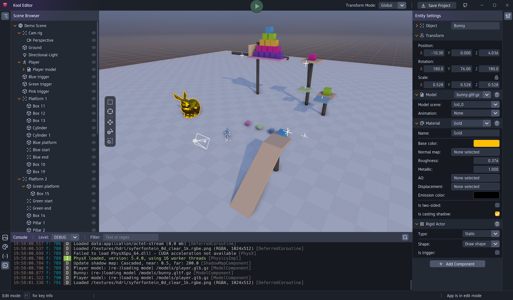

# kool Editor
{: .fs-9 .no_toc }

An interactive editor for creating 3D scenes, managing resources, integrating custom game logic and more.
{: .fs-6 .fw-300 }



---

## Table of contents
{: .no_toc .text-delta }

1. TOC
{:toc}

---

## Getting started

[Launch the web-editor][web-editor]{: .btn .btn-primary .fs-5 .mb-4 .mb-md-0 .mr-2 }

The editor runs locally in the JVM as well as in the browser. The [web-version][web-editor] offers the one-click solution
for getting started with the editor. However, since the web-version can't compile any code, you should use the
JVM version for any serious testing. You can still start with the web-version and use the `Save Project` button
in the upper right corner to download the example project, which you can then run locally. Alternatively you can
clone the [kool templates] and use the `kool-editor-template` as a starting point.

{: .warning }
The editor is still in an early state and I can't yet guarantee any backwards compatibility of future versions.
Hence, using it for serious projects is not yet recommended.

### Running the editor locally
The recommended workflow for an editor project is to open the downloaded project in [IntelliJ] (or any other
IDE of your choice) and run the kool editor in parallel. To do so, open the previously downloaded project in
IntelliJ and wait until the gradle build-script is synced (it should happen automatically).

Now start the kool editor by running the `runEditor` gradle task either from the Gradle tab in IntelliJ or from
a terminal with: 
```sh
./gradlew runEditor
```
The editor should open up and you should see the same example scene as in the web-editor with the benefit that
you are able to edit code as well.

## Editor basics
The basic scene editing features work similar to most 3D editing software and should be mostly self-explanatory.
Most editing features are also accessible via key-bindings and you can open a context-aware popup window, showing
you the currently available keys by pressing `F1`.

### Adding and removing objects
You can add objects by right-clicking into the scene view and select an object type from the `Add object` sub-menu
of the appearing popup-menu (e.g. `Add object` -> `Mesh` -> `Box` to add a box mesh). The object appears at the
click position and will have the same parent object as the object you selected with the initial right click.
Alternatively, you can right click any object in the `Scene Browser` on the left side and use the popup-menu there.

Objects can be removed via the right-click menu or by pressing `Delete`.

### Undo / redo, copy & paste and duplicate
Of course undo and redo work as expected by pressing `Ctrl + Z` / `Ctrl + Y` and you can use `Ctrl + C` and
`Ctrl + V` to copy and paste selected objects. Moreover, you can use `Ctrl + D` to duplicate the current selection
which is more or less identical to copy and immediately pasting it.

### Manipulating objects
You can move, rotate and scale selected objects either via the corresponding toolbar buttons on the left side of
the scene view or by using the hotkeys `G` (grab / move), `R` (rotate) and `S` (scale). The toolbar buttons enable
a transform gizmo for the selected objects which can then be used to transform the objects as you like.

When using the hotkeys however, you enter the immediate transform mode, which works very similar to how Blender
works but might be a bit unintuitive in case you never used Blender: In immediate transform mode, the objects are
transformed by simply moving the mouse, without the need to drag any fiddly gizmo handles. Moreover, you can constrain
the manipulation to a certain axis by pressing `X`, `Y` or `Z` or to a plane by pressing `Shift + X`, `Shift + Y`
or `Shift + Z`. Finally, in axis mode you can also type a number to manipulate the selected objects by that amount.
Press `Enter` or the left mouse button to apply the transform or `Esc` or the right mouse button to cancel the transform.

Immediate transform mode is very useful to do quick and precise manipulations. For example, if you want to move an
object 3.5 units to the right, you can simply select it and type `G` (to enter grab / move mode), `X` to constrain
movement to the x-axis then type `3.5` to move the object 3.5 units along the x-axis and finally press enter to apply
the movement.

During object manipulation you can also press `Ctrl` to get a ticked behavior with fixed increments and `Shift`
to get more precise manipulation.

### Transform mode
By default object transforms are relative to the global frame, but it often makes sense to use the local or parent
frame instead. You can do so by selecting the corresponding mode from the `Transform mode` chooser at the top of the
window.

## Object settings
The `Object settings` panel on the right side is used to customize objects. You can add arbitrary components
via the `Add Component` button in the bottom and edit the component properties in the editor.

TODO: Add explanations for more complex components (e.g. physics related components)

## Integrating custom code
The most powerful feature of the editor is the integration of custom code, which works by adding a custom `Behavior`
component to an object. Custom behaviors can be created with the JVM version of the editor by creating a new class
that extends `KoolBehavior` in the source code (i.e. in IntelliJ). A minimal custom behavior could look like this:

```kotlin
class SomeCustomBehavior : KoolBehavior() {
    override fun onInit() {
        // optional: do initialization stuff here 
    }

    override fun onUpdate(ev: RenderPass.UpdateEvent) {
        // optional: do most of your business here, called on every frame
    }
    
    override fun onPhysicsUpdate(timeStep: Float) {
        // optional: do physics related stuff here, called on every physics step
    }
}
```

Whenever you add or edit source-code and return to the kool editor window it detects the changes automatically and
reloads the scene including the changed code. I.e. after adding the above class stub, the editor would reload the
scene and you could select `Some Custom Behavior` from the `Add Component -> Behavior` menu.

### Editor visible properties
It's also possible to add (public mutable) properties to behavior classes, which then appear in the editor UI.
Property types supported by the editor are:

- Primitive types (numeric types, strings and booleans)
- Vector types (2, 3 and 4 components, int, float and double types. E.g. Vec2i, Vec3f, Vec4d)
- `GameEntity`, which can be assigned with any other scene object 
- `GameEntityComponent` and all its subclasses (e.g. `RigidActorComponent`)
- `KoolBehavior` and all its subclasses (e.g. any custom behavior class)

Properties can also be annotated to get a richer editor experience:

```kotlin
class SomeCustomBehavior : KoolBehavior() {
    @EditorInfo(label = "Meaningful label:", order = 1)
    @EditorRange(minX = 0.0, maxX = 100.0)
    var someNumber: Int = 17

    @EditorInfo(label = "Character:", order = 2)
    var giveMeSomeCharacter: CharacterControllerComponent? = null

    @EditorHidden
    var valueThatShouldNotShowUpInTheEditor = 1234
}
```
In this example the first two properties would show up in the editor, while the third property (annotated with
`@EditorHidden`) would not show up despite being public and mutable. Moreover, `someNumber` could only be assigned
with values between 0 and 100. `giveMeSomeCharacter` could be assigned with any `CharacterControllerComponent`
present in the scene.

### Interacting with the scene objects and other components
Besides assigning scene objects via the editor UI, behavior classes can also query them programmatically. After
a behavior class is attached to a scene object, it is accessible via `gameEntity`:
```kotlin
class SomeCustomBehavior : KoolBehavior() {
    override fun onInit() {
        logI { "I'm attached to ${gameEntity.name}" }
    }
}
```


For convenience, the `transform` component of the parent `gameEntity` is directly accessible in behavior classes:
```kotlin
class SomeCustomBehavior : KoolBehavior() {
    override fun onUpdate(ev: RenderPass.UpdateEvent) {
        // rotates the parent object by 90°/s around the Y-axis
        transform.rotate(90f.deg, Vec3f.Y_AXIS)
    }
}
```


Other components of the parent `gameEntity` can be queried via `getComponent()`:
```kotlin
class SomeCustomBehavior : KoolBehavior() {
    private val meshComponent by lazy { gameEntity.getComponent<MeshComponent>() }

    override fun onStart() {
        meshComponent?.drawNode?.let { mesh ->
            logI { "Mesh tri count: ${mesh.geometry.numPrimitives}" }
        }
    }
}
```

It's also possible to access the scene via `gameEntity.scene` and do scene-wide queries for components, iterate
over all scene objects, etc.


[web-editor]: https://fabmax.github.io/kool/kool-editor/
[kool templates]: https://github.com/fabmax/kool-templates
[IntelliJ]: https://www.jetbrains.com/idea/download